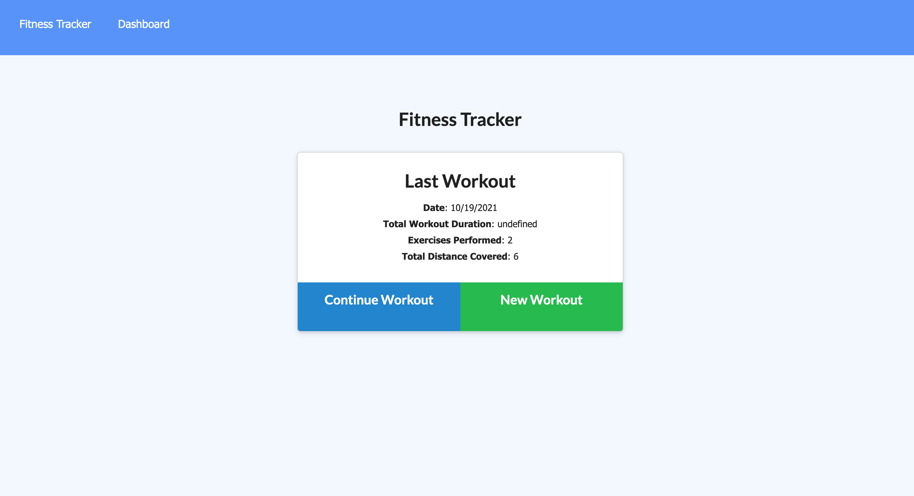

Fitness Tracker

The Fitness Tracker application is a user firendly app that allows the user to do a multitude of various functions to keep track of their fitness goals! They can achive their fitness goals through this app by allowing them to save details of their workout by firt creating a new workout or continuing one. After saving that data of completing or adding that workout they can then navigate to their dashboard where they are shown the various other workouts that have also been completed. There are two different graphs showing those previos woekout with their corresponding date making it easy for that user to organize and take away from.

Below is a link to the website
;

and here are the corresponding links to the website and the repo

https://peaceful-bastion-36552.herokuapp.com/

https://github.com/stephenryan183/fitness-tracker

